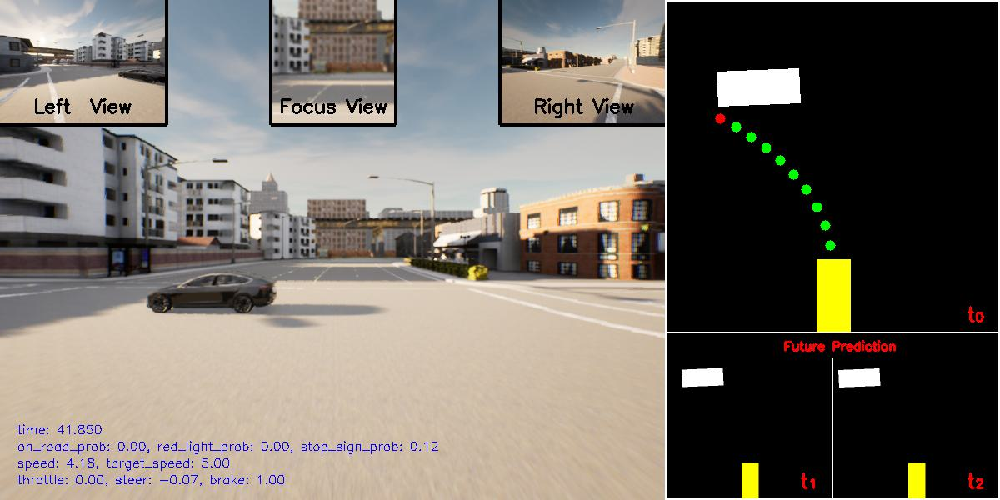
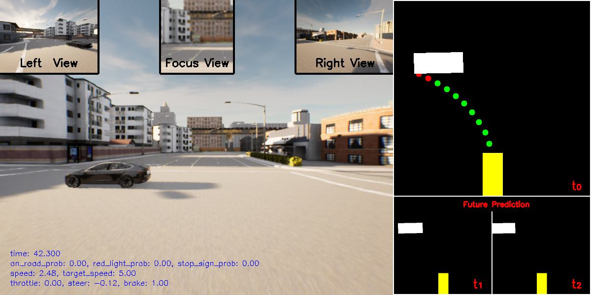
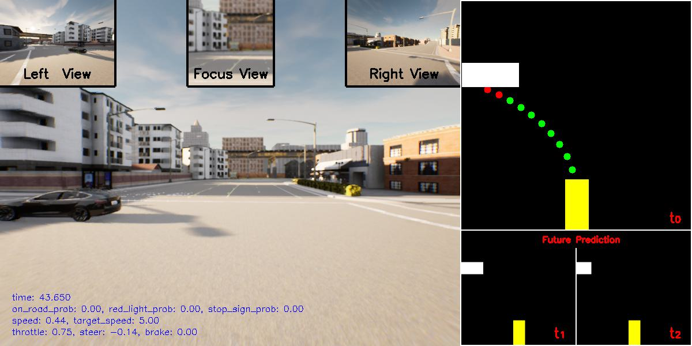

# BayScen Experiments: CARLA Simulation Setup & Execution

This directory contains all necessary code, configurations, and pre-generated scenarios to reproduce the BayScen experiments presented in our paper. The experiments evaluate autonomous vehicle (AV) safety using **CARLA Simulator 0.9.10**, **ScenarioRunner**, and the **InterFuser** end-to-end driving agent.

## Directory Structure

```
experiments/
├── assets/                          # Visualization screenshots
│   ├── s1.jpg
│   ├── s2.jpg
│   └── s3.jpg
│
├── InterFuser/                      # InterFuser agent
│
├── PythonAPI/                       # Modified CARLA Python API
│
├── scenario_runner-0.9.10/          # Modified ScenarioRunner
│   ├── scenario1_interfuser/        # Scenario 1 (Vehicle-Vehicle)
│   │   ├── generated_scenarios/     # Pre-generated test scenarios
│   │   │   ├── bayscen.xlsx
│   │   │   ├── random.xlsx
│   │   │   ├── sitcov.xlsx
│   │   │   ├── pict.xlsx
│   │   │   └── ctbc.xlsx
│   │   └── run_simulation.py
│   │
│   └── scenario2_interfuser/        # Scenario 1 (Vehicle-Cyclist)
│       ├── generated_scenarios/
│       │   ├── bayscen.xlsx
│       │   ├── random.xlsx
│       │   ├── sitcov.xlsx
│       │   ├── pict.xlsx
│       │   └── ctbc.xlsx
│       └── run_simulation.py
│
├── environment.yml                  # Conda environment specification
└── README.md                        # This file
```

## Overview

These experiments compare BayScen against five baseline methods for AV testing:
- **BayScen**: Our Bayesian Network-based approach
- **Random**: Random scenario generation
- **SitCov**: Situation coverage-based testing
- **PICT**: Pairwise combinatorial testing (2-way and 3-way)
- **CTBC**: Combinatorial testing with base choice

## Prerequisites

*   **OS:** Windows 10/11 (Instructions tailored for Windows CMD).
*   **GPU:** Dedicated GPU capable of running CARLA and PyTorch models.
*   **Anaconda:** Installed on your system.
*   **Storage:** Sufficient space for CARLA assets and model weights.

---

## Installation Step-by-Step

### 1. Environment Setup
We provide a YAML file to create a virtual environment with all necessary dependencies (PyTorch, CARLA Python API, etc.).

1.  Open your terminal (Anaconda Prompt recommended).
2.  Navigate to this folder and create the environment:
    ```bash
    conda env create -f environment.yml
    ```
3.  Activate the environment:
    ```bash
    conda activate simenv
    ```

### 2. Install CARLA 0.9.10
**⚠️ Strict Requirement:** You must use **CARLA version 0.9.10**. Newer or older versions will not work with these experiments.

1.  Create a folder on your drive (e.g., `D:\Carla10`).
2.  Download CARLA 0.9.10 from the [official documentation](https://carla.readthedocs.io/en/0.9.10/start_quickstart/).
3.  Extract the files into your `Carla10` folder.
4.  **Verification:**
    *   Start `CarlaUE4.exe`.
    *   Open a terminal, activate `simenv`, and navigate to `Carla10\WindowsNoEditor\PythonAPI\examples`.
    *   Run: `python spawn_npc.py`.
    *   *If vehicles appear in the simulator, the installation is correct.*

### 3. Install ScenarioRunner 0.9.10
**⚠️ Strict Requirement:** You must use **ScenarioRunner version 0.9.10**.

1.  Download the release from the [ScenarioRunner GitHub](https://github.com/carla-simulator/scenario_runner/tree/0.9.10).
2.  Extract the folder and rename it to `scenario_runner-0.9.10`.
3.  Place this folder inside your CARLA root: `Carla10\WindowsNoEditor\scenario_runner-0.9.10`.
4.  **Verification:**
    *   Ensure `CarlaUE4.exe` is running.
    *   Navigate to `scenario_runner-0.9.10`.
    *   Run:
        ```bash
        python scenario_runner.py --scenario NoSignalJunctionCrossing --reloadWorld
        ```
    *   In a separate terminal, run:
        ```bash
        python manual_control.py
        ```

### 4. Install InterFuser
1.  Clone or download the InterFuser repository from [OpenDILab](https://github.com/opendilab/InterFuser).
2.  Rename the downloaded folder to `InterFuser`.
3.  Place this folder inside your CARLA root: `Carla10\WindowsNoEditor\InterFuser`.

---

## Applying BayScen Modifications

To run our specific experiments, you must replace the standard folders with the modified versions provided in this repository.

1.  **Locate the source folders** in this repository (inside `experiments/`):
    *   `PythonAPI`
    *   `InterFuser`
    *   `scenario_runner-0.9.10`

2.  **Locate your CARLA installation** (`Carla10\WindowsNoEditor`).

3.  **Replace the folders:**
    *   Copy `experiments\PythonAPI` and **overwrite** `Carla10\WindowsNoEditor\PythonAPI`.
    *   Copy `experiments\InterFuser` and **overwrite** `Carla10\WindowsNoEditor\InterFuser`.
    *   Copy `experiments\scenario_runner-0.9.10` and **overwrite** `Carla10\WindowsNoEditor\scenario_runner-0.9.10`.

---

## Running Experiments

### 1. Configure Environment Variables
Before running any script, you must set the environment variables so Python can find CARLA and the models.

Run the following commands in your Command Prompt (CMD). **Make sure to replace `PATH_TO_CARLA10` with your actual path** (e.g., `D:\Carla10`).

```cmd
set CARLA_ROOT=PATH_TO_CARLA10\WindowsNoEditor
set SCENARIO_RUNNER_ROOT=PATH_TO_CARLA10\WindowsNoEditor\scenario_runner-0.9.10

:: Setup Python Paths
set PYTHONPATH=%CARLA_ROOT%\PythonAPI\carla\dist\carla-0.9.10-py3.7-win-amd64.egg
set PYTHONPATH=%PYTHONPATH%;%CARLA_ROOT%\PythonAPI\carla\agents
set PYTHONPATH=%PYTHONPATH%;%CARLA_ROOT%\PythonAPI\carla
set PYTHONPATH=%PYTHONPATH%;%CARLA_ROOT%\PythonAPI
set PYTHONPATH=%PYTHONPATH%;%SCENARIO_RUNNER_ROOT%\models
set PYTHONPATH=%PYTHONPATH%;%SCENARIO_RUNNER_ROOT%\models\research
set PYTHONPATH=%PYTHONPATH%;%SCENARIO_RUNNER_ROOT%\models\slim
set PYTHONPATH=%PYTHONPATH%;%SCENARIO_RUNNER_ROOT%
set PYTHONPATH=%PYTHONPATH%;%CARLA_ROOT%\InterFuser\leaderboard

:: Setup Experiment Variables
set ROUTES=leaderboard\data\evaluation_routes\routes_town03_long.xml
set TEAM_AGENT=leaderboard\team_code\interfuser_agent.py
set TEAM_CONFIG=leaderboard\team_code\interfuser_config.py
set CHECKPOINT_ENDPOINT=results\interfuser_result.json
set SCENARIOS=leaderboard\data\scenarios\town03_all_scenarios.json
```

### 2. Execute Simulation
1.  Navigate to the specific scenario folder inside ScenarioRunner:
    ```bash
    cd scenario_runner-0.9.10
    cd scenario1_interfuser 
    # OR: cd scenario2_interfuser (for scenario 2)
    ```

2.  Run the simulation script:
    ```bash
    python run_simulation.py --test_method bayscen --run_number 4
    ```

**Parameters:**
*   `--test_method`: The name of the method (e.g., `bayscen`). This **must** match an existing Excel file inside the `generated_scenarios` folder (e.g., `bayscen.xlsx`). All Excel files for BayScen and the other baselines used in the paper are already included in the `generated_scenarios` directory.
*   `--run_number`: The identifier for this experiment repetition.
    *   **⚠️ Important:** Runs `1`, `2`, and `3` contain the results used in our paper. Please use `--run_number 4` or higher to avoid overwriting existing results.

---

## Visualization

Below are examples of the InterFuser interface during **Scenario 1 (Vehicle-to-Vehicle Interaction)**. 

<p align="center">
    
  
  
</p>

## Support

For issues specific to:
- **CARLA**: Check CARLA GitHub issues
- **ScenarioRunner**: Check scenario_runner GitHub
- **InterFuser**: Check InterFuser repository
- **BayScen experiments**: [Create an issue in this repository]